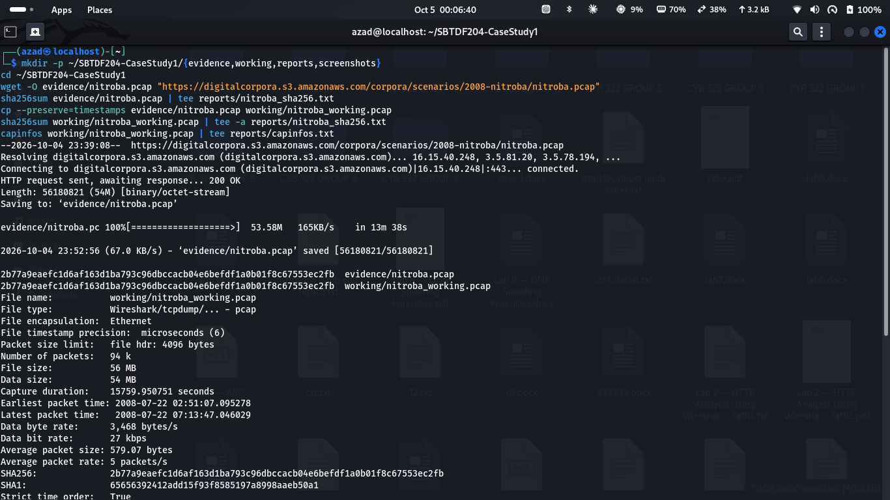
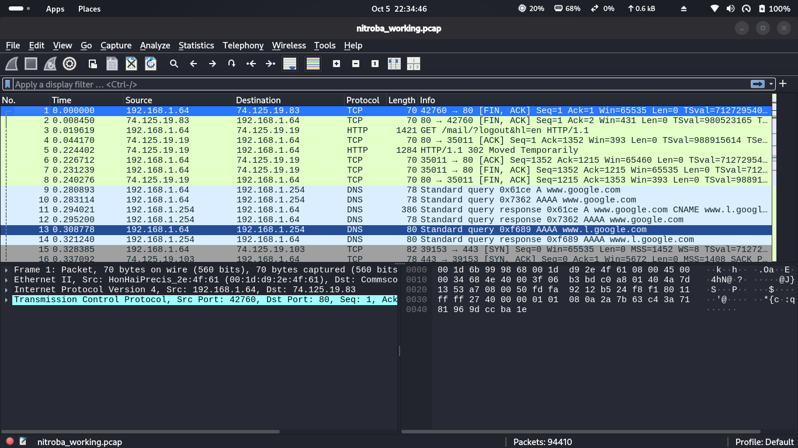
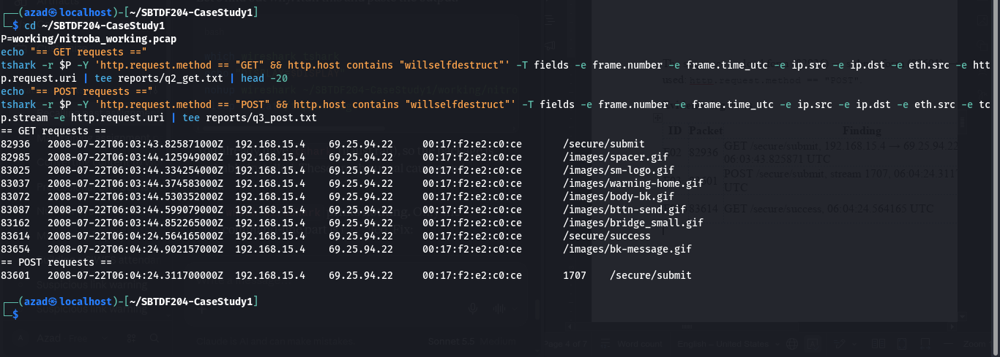
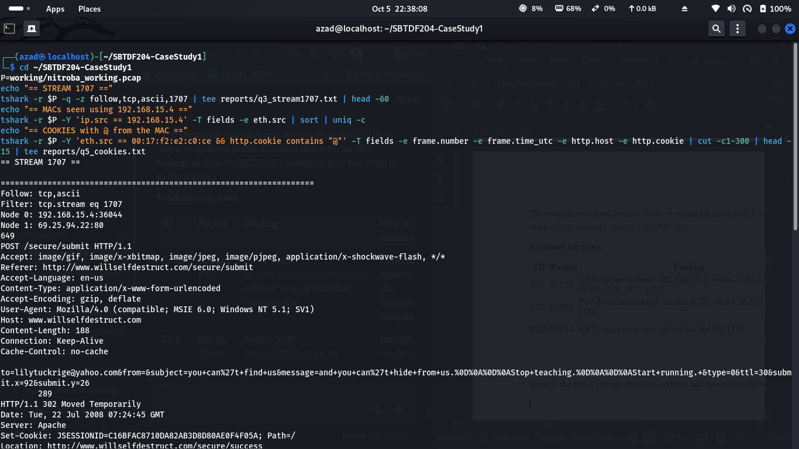
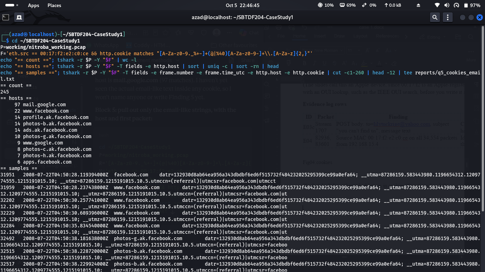
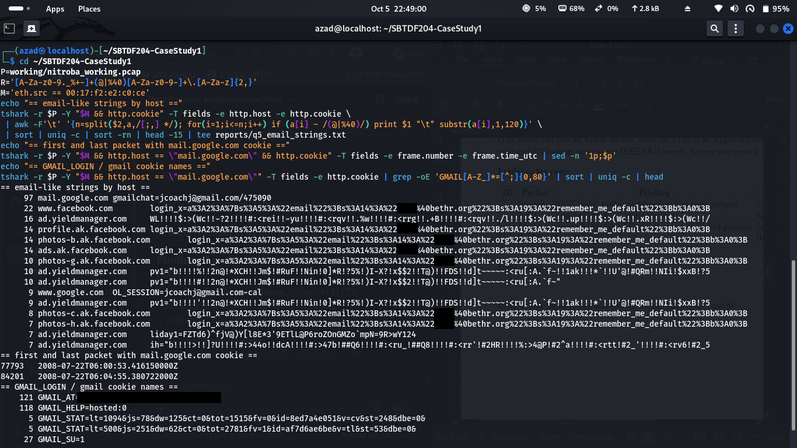
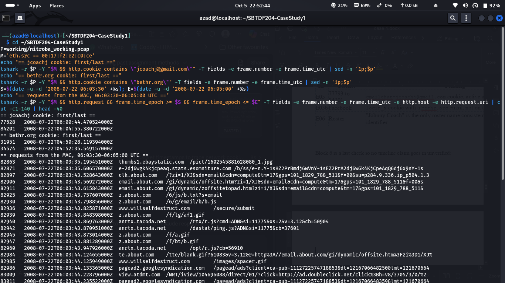

# Investigating Harassment Email Traffic With Wireshark

| | |
|---|---|
| **Lab Title** | Investigating Harassment Email Traffic With Wireshark |
| **Assignment Title** | Case Study 1: Individual forensic investigation |
| **Student Name** | Bashir Adam |
| **Student ID** | 2025/FWSD/11509 |
| **Course Name** | SBT-DF204 Computer Forensics Case Studies |
| **Instructor Name** | Aminu Idris |
| **Date of Submission** | 04 Oct, 2026 |
| **Version** | Version 2.4.0 |
| **Platform** | Kali Linux |

---

## Table of Contents

1. [Lab Overview](#1-lab-overview)
2. [Executive Summary](#2-executive-summary)
3. [Evidence Acquisition and Integrity](#3-evidence-acquisition-and-integrity)
4. [Method](#4-method)
5. [Findings](#5-findings)
6. [Attribution Assessment](#6-attribution-assessment)
7. [Evidence Log](#7-evidence-log)
8. [Figure Index](#8-figure-index)

---

## 1. Lab Overview

This individual case study investigates a simulated harassment-email complaint using supplied email material, a class roster and a packet capture. The report shows how the evidence was preserved, how the relevant web activity was found in Wireshark, and whether the traffic supports attribution to a student in Chemistry 109. An IP address is not assumed to prove identity, and the conclusion follows the evidence and states its limits.

### Case scenario

Lily Tuckrige, a Chemistry Department teacher, reports repeated harassing emails sent to her personal Yahoo Mail account. Full headers from an earlier message point to an IP address in a shared student residence where an open wireless router is in use. On Monday 21 July, a later message arrived through the web service willselfdestruct.com. The service briefly displayed the message and then reported that it had been destroyed. The university captured traffic at the residence network boundary and asks whether the available evidence supports attribution to a student in Chemistry 109.

---

## 2. Executive Summary

The packet capture shows that one network device (MAC `00:17:f2:e2:c0:ce`, IP `192.168.15.4`) loaded the message form at www.willselfdestruct.com and submitted a message addressed to lilytuckrige@yahoo.com at **06:04:24 UTC on 22 July 2008** (packet 83601). The message text reads: *"and you can't hide from us. Stop teaching. Start running."*

In the minutes around the submission, the same device sent cleartext cookies containing the Gmail identifier `jcoachj@gmail.com`. That identifier is consistent with the roster name "Johnny Coach", but the match rests on the naming pattern only. The capture does not state who owns the account and does not show who was typing.

**Confidence:** moderate that the device was in use by someone signed in to the `jcoachj@gmail.com` account at the time; low to moderate that this person wrote the message. The residence uses an open, password-less Wi-Fi router, so the device and account evidence cannot by itself prove which individual sent the message.

---

## 3. Evidence Acquisition and Integrity

| Field | Value |
|---|---|
| Case | SBT-DF204 Case Study 1: Investigating Harassment Email Traffic With Wireshark |
| Examiner | Bashir Adam (Azad), Reg. No. 2025/FWSD/11509 |
| Original file name | `nitroba.pcap` |
| Source | https://digitalcorpora.s3.amazonaws.com/corpora/scenarios/2008-nitroba/nitroba.pcap |
| File size | 56,180,821 bytes (about 54 MB) |
| Download date | 04 Oct 2026 (`wget` ran 23:39:08 to 23:52:56, system local time, WAT) |
| SHA-256 | `2b77a9eaefc1d6af163d1ba793c96dbccacb04e6befdf1a0b01f8c67553ec2fb` |
| SHA-1 (capinfos) | `65656392412add15f93f8585197a8998aaeb50a1` |
| Working copy | `working/nitroba_working.pcap`, made with `cp --preserve=timestamps`. All analysis used this copy. |
| Integrity check | The working copy's SHA-256 is identical to the original's, so the copy is bit-for-bit faithful. |
| Published checksum | None was available for comparison at the time of analysis; the calculated SHA-256 is recorded so another examiner can identify the file. |
| Capture format | pcap, Ethernet, microsecond precision, 94,410 packets, strictly time-ordered |
| Capture span (UTC) | 2008-07-22 01:51:07.095278 to 06:13:47.046029 (15,759.95 s, about 4 h 22 min). The workstation's local WAT display shows the same span one hour later (02:51:07 to 07:13:47), as seen in Fig00. |

*Fig00: Evidence acquisition: download, matching SHA-256 hashes of the original and the working copy, and capinfos output (E01).*

---

## 4. Method

1. Hashed the capture, copied it, re-hashed the copy and read capture metadata with `capinfos`.
2. Set time display to UTC. The workstation shows local time as WAT (UTC+1); `TZ=UTC capinfos` gave a first packet of 01:51:07 UTC against 02:51:07 local. All times in this report are UTC, taken from the PCAP.
3. Located web activity with `http.request.method == "GET" && http.host contains "willselfdestruct"` and the form submission with `http.request.method == "POST"`; read the full exchange with Follow TCP Stream (stream 1707).
4. Traced the device with `eth.addr == 00:17:f2:e2:c0:ce` and counted source MAC values for IP 192.168.15.4.
5. Searched cookies with `eth.src == 00:17:f2:e2:c0:ce && http.cookie contains "@"`. This first search matched random characters inside Amazon and advertising cookies (no email addresses), which were excluded. A stricter email-pattern search isolated the identifiers in Finding 5.
6. Packets were extracted and verified with `tshark` (Wireshark's command-line tool, same display filters), and the key packets were inspected in the Wireshark GUI for the figures in this report.
7. Compared the identifiers with the Chem 109 roster and built a timeline from PCAP timestamps.

*Fig01: The working copy `nitroba_working.pcap` opened in Wireshark; the status bar shows 94,410 packets, matching capinfos. (Default view: no filter applied, time column shows seconds since the first packet.)*

---

## 5. Findings

### Finding 1: File acquired and integrity

See [Evidence Acquisition and Integrity](#3-evidence-acquisition-and-integrity). The file `nitroba.pcap` (SHA-256 `2b77a9ea…ec2fb`) was copied and all analysis was done on the copy. **Evidence:** E01, Fig00, Fig01.

### Finding 2: Client system and service

The client IP is **192.168.15.4** and the service IP is **69.25.94.22** (HTTP Host: www.willselfdestruct.com). In packet **82936** (2008-07-22 06:03:43.825871 UTC) the client sent `GET /secure/submit`, which loads the message-composition form. Packets 82985 to 83162 then fetched that page's images (`spacer.gif`, `sm-logo.gif`, `warning-home.gif`, `body-bk.gif`, `bttn-send.gif`, `bridge_small.gif`) from the same client to the same server, all with the same source MAC.

**Filter:** `http.request.method == "GET" && http.host contains "willselfdestruct"`
**Evidence:** E02, Fig02.

*Fig02: GET requests (packets 82936 to 83654) and the single POST (packet 83601, stream 1707) between 192.168.15.4 and 69.25.94.22, all with source MAC `00:17:f2:e2:c0:ce` (E02, E03, E03b).*

### Finding 3: Link between the client and the harassment message

Packet **83601** (06:04:24.311700 UTC), in TCP stream **1707**, is `POST /secure/submit` from 192.168.15.4:36044 to 69.25.94.22:80. It came 40.49 s after the form was loaded (packet 82936), which fits a user typing a message. Following the stream shows the form fields in cleartext:

| Field | Value |
|---|---|
| `to` | lilytuckrige@yahoo.com |
| `from` | (empty) |
| `subject` | you can't find us |
| `message` | and you can't hide from us. Stop teaching. Start running. |
| `ttl` / `type` | 30 / 0 |

The server replied `302 Moved Temporarily` to `/secure/success` and issued a `JSESSIONID` cookie. Packet **83614** (06:04:24.564165 UTC) is the client's `GET /secure/success`, 0.25 s after the POST, which indicates the submission was accepted. The sequence is: load form (82936), submit form (83601), confirmation page (83614). The `Referer` header (`http://www.willselfdestruct.com/secure/submit`) confirms the form was loaded first. The recipient address matches the complainant's reported address, and the subject and message match the tone of the complaint.

**Filter:** `http.request.method == "POST"`
**Evidence:** E03, E03b, E03c, Fig03, Fig04.

> **Limitation:** the capture shows what was submitted and from where. It does not show the text Ms. Tuckrige later saw, because that stage happened outside the monitored network.

> **Clock discrepancy:** the server's `Date` header in the response to the POST reads `Tue, 22 Jul 2008 07:24:45 GMT`, about 1 h 20 min later than the sniffer's 06:04:24 UTC for the same exchange. The sniffer and server clocks were not synchronised. PCAP timestamps are used throughout. **Evidence:** E07, Fig04.

*Fig03: Wireshark GUI with filter `http.host contains "willselfdestruct"`: POST packet 83601 selected, Ethernet II (source MAC) and HTTP detail expanded, time column in UTC (E03, E04).*

*Fig04: Follow TCP stream 1707: the POST body (`to=`, `subject=`, `message=`) and the server response, including the `Date` header (E03c, E07).*

### Finding 4: Device that made the request

All **34,554** packets in the capture with source IP 192.168.15.4 carry source MAC **`00:17:f2:e2:c0:ce`**, including packets 82936 (GET) and 83601 (POST). The IP and MAC therefore map consistently to one network interface. The request's User-Agent was `Mozilla/4.0 (compatible; MSIE 6.0; Windows NT 5.1; SV1)`.

**Filter:** `eth.addr == 00:17:f2:e2:c0:ce`
**Evidence:** E04, Fig02, Fig03.

**Why the IP address alone cannot prove identity:** 192.168.15.4 is a private address inside a room that uses an open Wi-Fi router with no password. Any resident, visitor or nearby person could join that network and receive an address in the same range, and addresses can change over time. The MAC address identifies one network interface, not a person, and it can be changed or spoofed. The IP and MAC therefore identify a device, and further evidence is needed to link it to a person.

The vendor prefix `00:17:f2` has not been verified against the IEEE registry in this report, so no statement is made about the hardware vendor. The User-Agent indicates Windows XP with Internet Explorer 6.

### Finding 5: Person associated with the device

A first search for "@" in cookies from the device matched Amazon and advertising-network cookies where `@` is a random character. These are not identities and were excluded. A stricter search for email-like strings (245 matching packets, Fig05) found two account identifiers (Fig06):

- **Gmail / Google:** `gmailchat=jcoachj@gmail.com/475090` in 97 packets to mail.google.com, and `OL_SESSION=jcoachj@gmail.com-cal` in 9 packets to www.google.com. Packets containing `jcoachj@gmail.com` span packet **77528** (06:00:44.470524 UTC) to packet **84201** (06:04:55.380722 UTC). The POST (packet 83601) falls inside this window, 3 min 39.84 s after the first and 31.07 s before the last. A Gmail channel request from the device (packet 83326, 06:04:05.546193 UTC) came 18.77 s before the POST. The Gmail session token in these requests is not reproduced in this report.
- **Facebook:** a `login_x` cookie sent to www.facebook.com and its subdomains whose URL-decoded value holds an email address at the domain `bethr.org` (local part redacted). These packets span packet 31951 (04:50:28.119394 UTC) to packet 34574 (04:52:35.549157 UTC), about 1 h 11 min 49 s before the POST.

Fig06 lists the first and last `mail.google.com` request with a cookie as packets 77793 and 84201; packet 77793 is the first `mail.google.com` request carrying any cookie, while the first packet containing the `jcoachj@gmail.com` string is 77528 (Fig07).

**Filters:** `eth.src == 00:17:f2:e2:c0:ce && http.cookie contains "jcoachj"` and the same filter with `"bethr.org"`
**Evidence:** E05, E05b, E08, Fig05, Fig06, Fig07.

*Fig05: Email-pattern search of cookies from MAC `00:17:f2:e2:c0:ce`: 245 matching packets, by host. The sample rows are Facebook tracking cookies, not identities.*

*Fig06: Email-like strings in cookies by host: `gmailchat=jcoachj@gmail.com/475090` (mail.google.com), `OL_SESSION=jcoachj@gmail.com-cal` (www.google.com) and the Facebook `login_x` cookie (bethr.org). The Gmail session token and the email local part are redacted (E05, E05b).*

*Fig07: First and last packet for the `jcoachj@gmail.com` cookie (77528 to 84201) and the `bethr.org` cookie (31951 to 34574), and the device's requests from 06:03:30 to 06:05:00 UTC, including `GET /secure/submit` (packet 82936) at 06:03:43.825871 (E05, E05b, E08).*

### Finding 6: Roster comparison

The Chem 109 roster (instructor Lily Tuckrige) lists: Amy Smith, Burt Greedom, Tuck Gorge, Ava Book, Johnny Coach, Jeremy Ledvkin, Nancy Colburne, Tamara Perkins, Esther Pringle, Asar Misrad and Jenny Kant.

- The Gmail identifier `jcoachj@gmail.com` is consistent with the roster name **Johnny Coach** (first initial and surname). This is an inference from the naming pattern; the capture does not give the account holder's name.
- The `bethr.org` Facebook identity does not correspond to any name on the roster.

**Evidence:** E06.

### Finding 7: When the activity occurred (timeline)

Wireshark was set to UTC Date and Time of Day. The workstation's local time is WAT (UTC+1), so a local display is one hour ahead of the times below. No other conversion was made.

| Time (UTC), 22 Jul 2008 | Packet | Event |
|---|---|---|
| 04:50:28.119 | 31951 | First packet with the `bethr.org` Facebook login cookie |
| 04:52:35.549 | 34574 | Last packet with the `bethr.org` Facebook login cookie |
| 06:00:44.471 | 77528 | First packet with the `jcoachj@gmail.com` identifier |
| 06:03:43.826 | 82936 | `GET /secure/submit`: form loaded from willselfdestruct.com |
| 06:04:05.546 | 83326 | Gmail channel request to mail.google.com from the same device |
| 06:04:24.312 | 83601 | `POST /secure/submit`: message sent to lilytuckrige@yahoo.com (stream 1707) |
| 06:04:24.564 | 83614 | `GET /secure/success`: submission accepted (+0.25 s) |
| 06:04:55.381 | 84201 | Last packet with the `jcoachj@gmail.com` identifier (+31.07 s after POST) |

### Finding 8: Conclusion

The capture shows that the device with MAC `00:17:f2:e2:c0:ce` (IP `192.168.15.4`) submitted the harassment message to willselfdestruct.com at 06:04:24 UTC while a Gmail session for `jcoachj@gmail.com` was active on that device. This is consistent with the roster entry "Johnny Coach". See [Attribution Assessment](#6-attribution-assessment) for the confidence level and limitations.

---

## 6. Attribution Assessment

### Direct observations

- Device `00:17:f2:e2:c0:ce` at 192.168.15.4 loaded the willselfdestruct.com form (packet 82936) and submitted the POST (packet 83601) at 06:04:24 UTC.
- The POST addressed lilytuckrige@yahoo.com and contained the quoted message text.
- The same device sent cookies containing `jcoachj@gmail.com` from 06:00:44 to 06:04:55 UTC, a window that includes the POST.

### Reasonable inferences

- The browser that submitted the form had the Google account `jcoachj@gmail.com` open at that time.
- The identifier fits the roster name Johnny Coach, so a Chem 109 student may have used the device.

### Limitations and alternative explanations

1. **Shared open wireless network:** anyone in the room or in range could use the router, so the IP and MAC identify a device and not a person.
2. **A second identity** (`bethr.org` Facebook login), not on the roster, appears on the same device about 72 minutes before the POST, so more than one person may use the device.
3. **A signed-in cookie** shows an account was open in the browser, not who was typing; a session can be left open or used by someone else.
4. **The name match is by naming pattern only;** nothing in the capture states who owns `jcoachj@gmail.com`.
5. **Clock mismatch:** the sniffer and server clocks disagree by about 1 h 20 min, so server-side times are not relied on.
6. **Scope of the capture:** it covers only the residence network boundary and does not show delivery of the message to the complainant.

**Confidence level:** moderate that someone signed in to the `jcoachj@gmail.com` account was using the device when the message was sent; low to moderate that this person wrote it. Further evidence, such as the router's association logs or interviews carried out through the proper authority, would be needed to attribute the message to an individual.

---

## 7. Evidence Log

| ID | Packet or item | Finding | Why it matters | Figure |
|---|---|---|---|---|
| E01 | `nitroba.pcap` and working copy | SHA-256 identical for original and copy; 94,410 packets | Shows analysis used an unaltered copy | Fig00, Fig01 |
| E02 | 82936 | `GET /secure/submit`, 192.168.15.4 to 69.25.94.22, 06:03:43.825871 | Client reached the message form | Fig02 |
| E03 | 83601 | `POST /secure/submit`, stream 1707, 06:04:24.311700 | Form submission to the service | Fig02, Fig03 |
| E03b | 83614 | `GET /secure/success`, 06:04:24.564165 | Server accepted the submission | Fig02 |
| E03c | Stream 1707 | `to=lilytuckrige@yahoo.com`, subject and message text | Content matches the complaint | Fig04 |
| E04 | 82936, 83601 | Source MAC `00:17:f2:e2:c0:ce` on all 34,554 packets from 192.168.15.4 | Identifies the device, not the person | Fig02, Fig03 |
| E05 | 77528 to 84201 | `jcoachj@gmail.com` in `gmailchat` and `OL_SESSION` cookies | Gmail account active around the POST | Fig05, Fig06, Fig07 |
| E05b | 31951 to 34574 | `login_x` cookie with a `bethr.org` email (local part redacted) | Second, non-roster identity on the device | Fig06, Fig07 |
| E06 | Roster | Johnny Coach is the roster name consistent with `jcoachj` | Basis for roster comparison (inference) | Finding 6 |
| E07 | Response to 83601 | Server `Date` 07:24:45 GMT vs PCAP 06:04:24 UTC | Clock mismatch; PCAP time used | Fig04 |
| E08 | 83326 | Gmail channel request from the device, 06:04:05.546193 | Gmail in use shortly before the POST | Fig07 |

---

## 8. Figure Index

| Figure | File (in `screenshots/`) | Section | Shows |
|---|---|---|---|
| Fig00 | `Fig00_evidence_acquisition_hash_capinfos.png` | 3. Evidence Acquisition | Download, matching hashes, capinfos |
| Fig01 | `Fig01_capture_opened_in_wireshark_94410_packets.png` | 4. Method | Working copy opened in Wireshark, 94,410 packets |
| Fig02 | `Fig02_tshark_get_post_willselfdestruct.png` | Finding 2 | GET and POST requests to the service, source MAC |
| Fig03 | `Fig03_wireshark_post_packet83601_ethernet_mac.png` | Finding 3 | POST packet in Wireshark, Ethernet II, UTC time |
| Fig04 | `Fig04_tcp_stream1707_post_body.png` | Finding 3 | Stream 1707: POST body and server response |
| Fig05 | `Fig05_cookie_email_pattern_search_245_packets.png` | Finding 5 | Email-pattern cookie search, 245 packets by host |
| Fig06 | `Fig06_cookie_identifiers_gmail_facebook_redacted.png` | Finding 5 | Gmail and Facebook identifiers (redacted) |
| Fig07 | `Fig07_identity_windows_and_traffic_around_post.png` | Finding 5 | Identity time windows and traffic around the POST |

*Training material from the Nitroba University Harassment Scenario (Digital Corpora) was used only for this authorised academic case study. No host, account or person in the evidence was contacted.*
